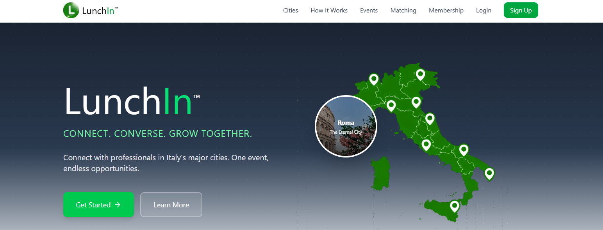
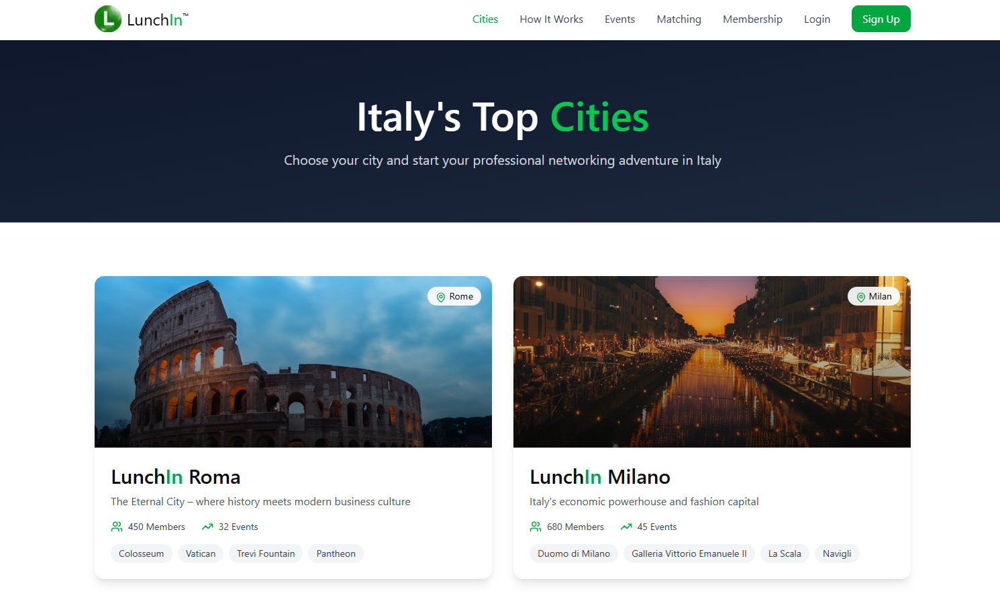
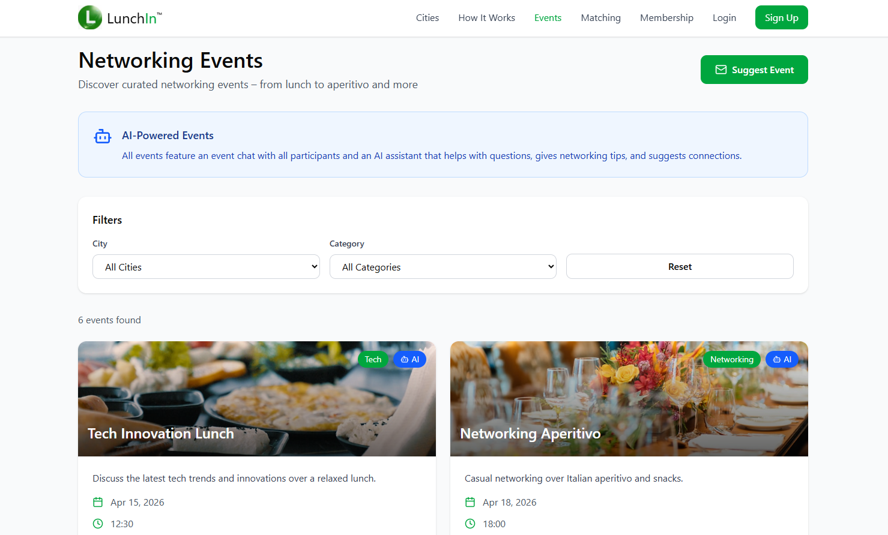

LunchIn Italy

LunchIn Italy is a web platform for curated professional networking events — designed to bring people together in real life.

🚀 Overview
LunchIn focuses on meaningful, in-person connections through small, curated group experiences.

Instead of large, impersonal events, the platform enables:
- natural conversations  
- high-quality connections  
- a more human approach to networking  

This project represents the digital product layer of LunchIn, starting in Italy 🇮🇹

### Landing Page

🧠 Concept
Networking often feels transactional and forced.

LunchIn aims to change that by creating:
- curated group settings  
- relaxed environments  
- intentional connections  

**Connect. Converse. Grow Together.**

### City Discovery

🛠️ Tech Stack
- Ruby on Rails  
- PostgreSQL  
- Tailwind CSS  
- Hotwire (Turbo & Stimulus)

✨ Core Features (MVP)
- City-based event discovery  
- Curated events hosted by ambassadors  
- Participation requests & attendee management  
- Event-based group chat  
- Direct messaging  
- Key connections (save meaningful contacts)  
- AI-powered insights & feedback *(planned)*  

### Events

📍 Status

Currently in development.  
First release focuses on Italy

🎯 Vision
To build a platform that enables real-world connections, meaningful conversations, and a more human way of networking.

---

More updates coming soon 🚀
